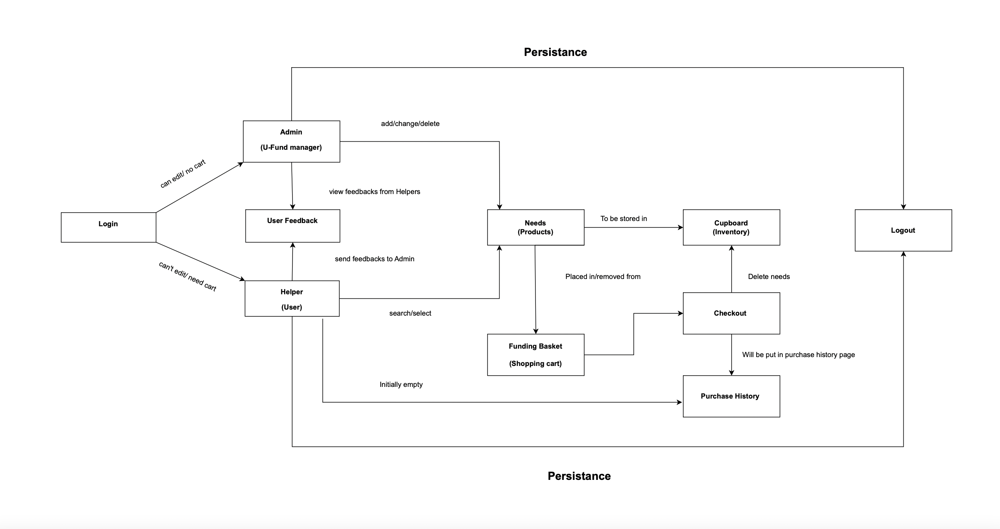
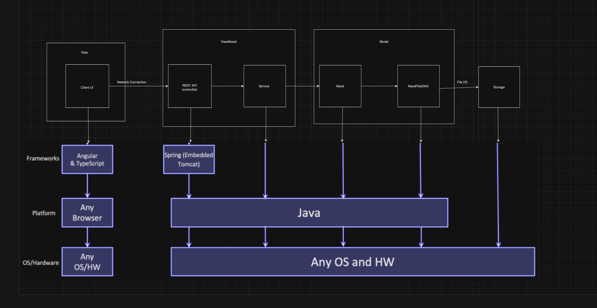
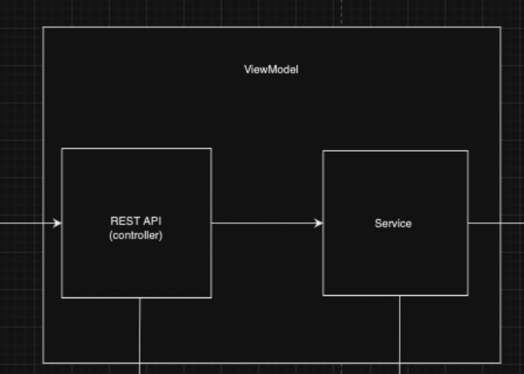
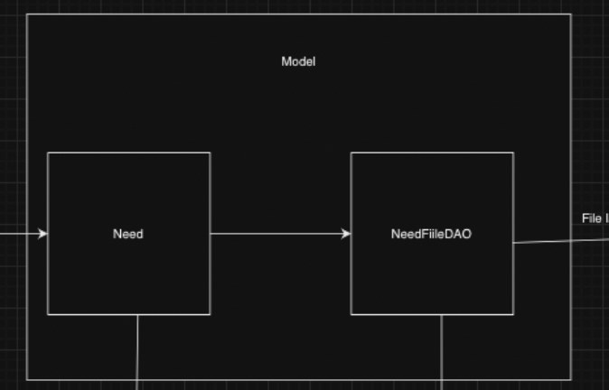
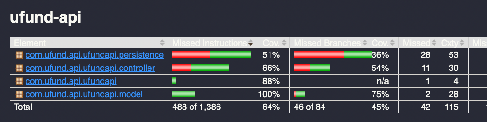

# PROJECT Design Documentation

> _The following template provides the headings for your Design
> Documentation.  As you edit each section make sure you remove these
> commentary 'blockquotes'; the lines that start with a > character
> and appear in the generated PDF in italics but do so only **after** all team members agree that the requirements for that section and current Sprint have been met. **Do not** delete future Sprint expectations._

## Team Information
* Team name: BCNS
* Team members
  * Nam Huynh
  * Saavan Tandon
  * Borneil Gope
  * Cameron Marsh

## Executive Summary

This is a project which creates a website for a food charity. In this website, the user is able to login as a user or an admin using a username and password. The admin is able to view the needs cupboard and add or delete needs from it. The Helper is able to view the needs in the needs cupboard that the admin has added. The Helper can also search for needs using a search bar and have access to view and modify the funding basket. Items in the funding basket persist even after the Helper logs out and logs back in. Users can also send feedback to the admin, which the admin can see after they log in. The users can "check out" needs when they have decided to contribute to them, and they can also see a history of previous needs they have contributed to that persists through log in and log outs.

### Purpose
> _**[Sprint 2 & 4] Provide a very brief statement about the project and the most important user group and user goals.

The U-Fund Chairty webpage will allow Helpers to donate money to causes and items in order to assist the food bank. This will
allow people with money to spare to assist those who are in need.

### Glossary and Acronyms
> _**[Sprint 2 & 4]** Provide a table of terms and acronyms._

| Term    |            Definition               |
|---------|-------------------------------------|
| SPA     |  Single Page                        |
| DAO     |  Data Access Object                 |
| CSS	    |  Cascading Style Sheets             |
| TS	    |  Type Script                        |
| Angular |  Framework for web application      |
| HTML    |	 Hypertext Markup Language          |
| Admin   |	 Can edit products and orders       |
| Admin   |  User that can edit the inventory   |
| Helper  |  User that can edit their cart      |
| Need    |  A purchasable item in the cupboard |
| Cupboard|  Access to the needs                |

## Requirements

This section describes the features of the application.

> _In this section you do not need to be exhaustive and list every
> story.  Focus on top-level features from the Vision document and
> maybe Epics and critical Stories._

  - Admin can add, remove, and modify needs in the needs cupboard
  - Helper can browse needs in the needs cupboard and search using keywords
  - Helper can add/delete products from their cart
  - Helper can log in to an existing account with username and password, or register should the account not exist
  - Helper can checkout their needs from the basket

### Definition of MVP
> _**[Sprint 2 & 4]** Provide a simple description of the Minimum Viable Product._

  - Minimal Authentication for Helper/U-fund Manager login & logout
    - A Helper can create a new account with a new username and password
    - A Helper can log into an existing account
    - The Admin already has an account in the system
    - The Admin and Helper can log out of their account
    - Data Persistence on the Helper Basket
    - Username of user is unique

  - Helper functionality
    - Helper can see list of needs
    - Helper can search for a need
    - Helper can add/remove an need to their funding basket
    - Helper can proceed to check-out and fund all needs they are supporting

  - Needs Management
    - U-fund Manager(s) can add, remove and edit the data of all their needs stored in their needs cupboard
    - A U-fund Manager cannot see contents of funding basket(s) of Helpers
    - A U-fund Manager does not have a basket

  - Data Persistence
    - The contents of the Helper basket in the basket will remain the same when the Helper log out and log back in.
    - When a Helper purchase all the need from the Cupboard, another Helper will not be able to see the needs from the Cupboard anymore until the Admin restock

### MVP Features
>  _**[Sprint 4]** Provide a list of top-level Epics and/or Stories of the MVP._

### Enhancements
> _**[Sprint 4]** Describe what enhancements you have implemented for the project._

## Application Domain

This section describes the application domain.

> _**[Sprint 2 & 4]** Provide a high-level overview of the domain for this application. You
> can discuss the more important domain entities and their relationship
> to each other._

## Architecture and Design

This section describes the application architecture.

### Summary

The following Tiers/Layers model shows a high-level view of the webapp's architecture. 
**NOTE**: detailed diagrams are required in later sections of this document.
> _**[Sprint 1]** (Augment this diagram with your **own** rendition and representations of sample system classes, placing them into the appropriate M/V/VM (orange rectangle) tier section. Focus on what is currently required to support **Sprint 1 - Demo requirements**. Make sure to describe your design choices in the corresponding _**Tier Section**_ and also in the _**OO Design Principles**_ section below.)_

The web application, is built using the Model–View–ViewModel (MVVM) architecture pattern. 

The Model stores the application data objects including any functionality to provide persistance. 

The View is the client-side SPA built with Angular utilizing HTML, CSS and TypeScript. The ViewModel provides RESTful APIs to the client (View) as well as any logic required to manipulate the data objects from the Model.

Both the ViewModel and Model are built using Java and Spring Framework. Details of the components within these tiers are supplied below.

### Overview of User Interface

This section describes the web interface flow; this is how the user views and interacts with the web application.

> _Provide a summary of the application's user interface.  Describe, from the user's perspective, the flow of the pages in the web application._

### View Tier
> _**[Sprint 4]** Provide a summary of the View Tier UI of your architecture.
> Describe the types of components in the tier and describe their
> responsibilities.  This should be a narrative description, i.e. it has
> a flow or "story line" that the reader can follow._

> _**[Sprint 4]** You must  provide at least **2 sequence diagrams** as is relevant to a particular aspects 
> of the design that you are describing.  (**For example**, in a shopping experience application you might create a 
> sequence diagram of a customer searching for an item and adding to their cart.)
> As these can span multiple tiers, be sure to include an relevant HTTP requests from the client-side to the server-side 
> to help illustrate the end-to-end flow._

> _**[Sprint 4]** To adequately show your system, you will need to present the **class diagrams** where relevant in your design. Some additional tips:_
 >* _Class diagrams only apply to the **ViewModel** and **Model** Tier_
>* _A single class diagram of the entire system will not be effective. You may start with one, but will be need to break it down into smaller sections to account for requirements of each of the Tier static models below._
 >* _Correct labeling of relationships with proper notation for the relationship type, multiplicities, and navigation information will be important._
 >* _Include other details such as attributes and method signatures that you think are needed to support the level of detail in your discussion._

### ViewModel Tier
> _**[Sprint 1]** List the classes supporting this tier and provide a description of there purposes_

- **NeedController:** Responds to HTML requests for the Needs resource. It connects the Need UI to the Need model
in the backend and will create, update, and get needs from the needs cupboard as necessary, all by accessing
methods in NeedDAO objects.

- **HelperController:** Responds to HTML requests for the Helper resource. It connects the Funding Basket and Helper
related UI to the backend, with functionality to create, get and authenticate helpers as well as manipulate
a Helper's Funding Basket, all by accessing methods in HelperDAO objects.

- **NeedDAO:** An interface for the Data Access Object used to access and modify the underlying storage
for the Needs Cupboard.

- **NeedFileDAO:** The specific implementation of NeedDAO. Contains functionality to create and get a need from
the underlying storage, as well as search, update, and delete.

- **HelperDAO:** An interface for the Data Access Object used to access and modify the underlying storage for
Helpers and their funding baskets.

- **HelperFileDAO:** the specific implementation of HelperDAO. Access the underlying storage to create, 
get, and update Helpers as well as their Funding Baskets. Also authenticates their login credentials.

> _**[Sprint 4]** Provide a summary of this tier of your architecture. This
> section will follow the same instructions that are given for the View
> Tier above._

> _At appropriate places as part of this narrative provide **one** or more updated and **properly labeled**
> static models (UML class diagrams) with some details such as critical attributes and methods._
> 

### Model Tier
> _**[Sprint 1]** List the classes supporting this tier and provide a description of there purpose._

**Need:** Acts as a Java representation of a single need and its attributes. Works in tandem
with NeedFileDAO and NeedController such that needs are loaded from the underlying 
storage into Need instances.

**Helper:** Acts as a Java representation for a single Helper, its data, and its Funding Basket.
Works in tandem with HelperController and HelperFileDAO to load Helpers and their funding
baskets from the underlying storage into Helper instances.

> _**[Sprint 2, 3 & 4]** Provide a summary of this tier of your architecture. This
> section will follow the same instructions that are given for the View
> Tier above._

> _At appropriate places as part of this narrative provide **one** or more updated and **properly labeled**
> static models (UML class diagrams) with some details such as critical attributes and methods._
> 

## OO Design Principles

> _**[Sprint 1]** Name and describe the initial OO Principles that your team has considered in support of your design (and implementation) for this first Sprint._

**Low Coupling:** (describe how DAO interfaces reduce coupling between Controllers and DAOs)

**Dependency Inversion/Injection:** (describe how DAO interfaces are injected into Controller classes' contructors rather than being
initialized in the controller)

**Pure Fabrication:** (describe how HelperFileDAO/NeedFileDAO doesn't represent a real entity but is created
for the purpose of separating the methods that access Helper and Need storage )

> _**[Sprint 2, 3 & 4]** Will eventually address upto **4 key OO Principles** in your final design. Follow guidance in augmenting those completed in previous Sprints as indicated to you by instructor. Be sure to include any diagrams (or clearly refer to ones elsewhere in your Tier sections above) to support your claims._

> _**[Sprint 3 & 4]** OO Design Principles should span across **all tiers.**_

## Static Code Analysis/Future Design Improvements
> _**[Sprint 4]** With the results from the Static Code Analysis exercise, 
> **Identify 3-4** areas within your code that have been flagged by the Static Code 
> Analysis Tool (SonarQube) and provide your analysis and recommendations.  
> Include any relevant screenshot(s) with each area._

> _**[Sprint 4]** Discuss **future** refactoring and other design improvements your team would explore if the team had additional time._

## Testing
> _This section will provide information about the testing performed
> and the results of the testing._

### Acceptance Testing
> **[Sprint 2 & 4]** Report on the number of user stories that have passed all their
> acceptance criteria tests, the number that have some acceptance
> criteria tests failing, and the number of user stories that
> have not had any testing yet. Highlight the issues found during
> acceptance testing and if there are any concerns._

- **23** user stories in total, covering:
  - Admins being able to edit needs from the cupboard
  - Helpers being able to login/creating their account
  - Helpers being able to edit needs from their basket
  - Helpers being able to checkout their basket
  - Helpers being able to search for needs
  - Persistence of the shopping carts

**All user stories have passed their acceptance criteria tests.**

### Unit Testing and Code Coverage
> _**[Sprint 4]** Discuss your unit testing strategy. Report on the code coverage
> achieved from unit testing of the code base. Discuss the team's
> coverage targets, why you selected those values, and how well your
> code coverage met your targets._

>_**[Sprint 2 & 4]** **Include images of your code coverage report.** If there are any anomalies, discuss those._

- The reason for low percentages on the Persistence tier is because the team is currently missing one of the test file for HelperFileDAO. The team will implement and improve the unit tetsing for both persistence and controller classes for the following Sprint.

## Ongoing Rationale
>_**[Sprint 1, 2, 3 & 4]** Throughout the project, provide a time stamp **(yyyy/mm/dd): Sprint # and description** of any _**major**_ team decisions or design milestones/changes and corresponding justification._

  - (2024/2/10): Sprint 1
    - The 10% feature will be Helper Feedback and Purchase History Page
  - (2024/3/19): Sprint 2
    - The team will change the architecture of the project significantly by removing the Basket logic in the API entirely and will be represented as an array of Needs in the Helper
    - Rationale:
      - Reduce the number of unnecessary unit testing
      - Making the Basket as an attribute of Helper would make a significantly improvement on the design and better adherence to GRASP Principles by reducing Coupling